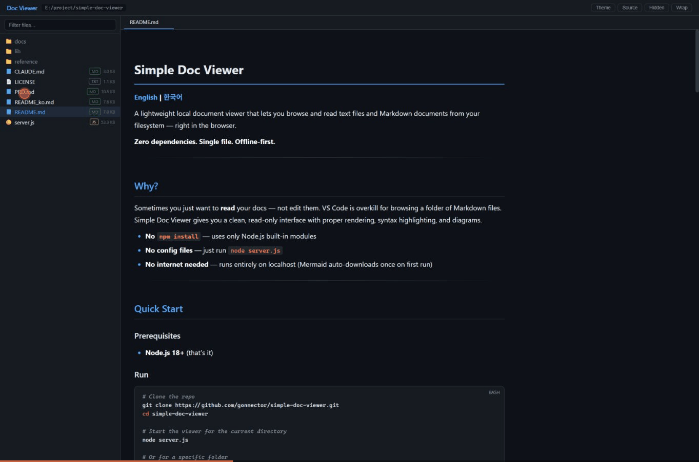
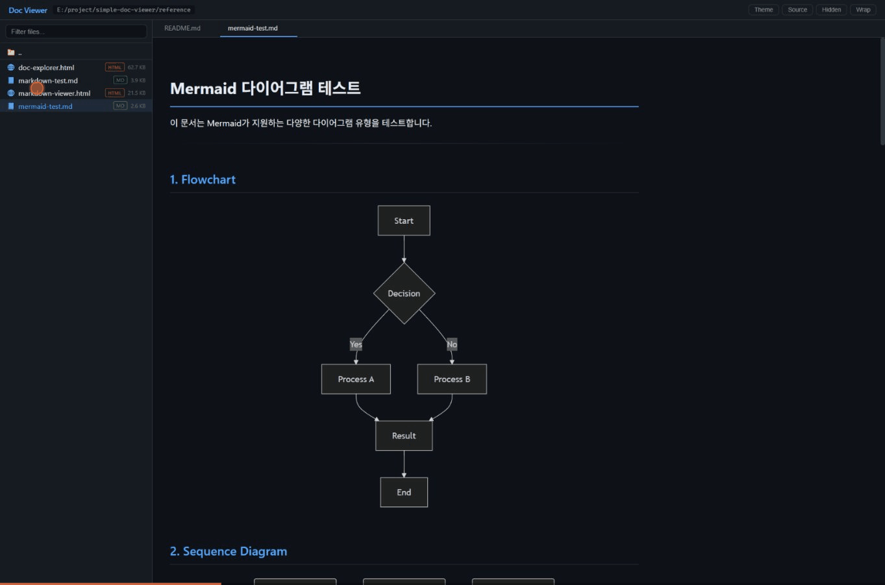
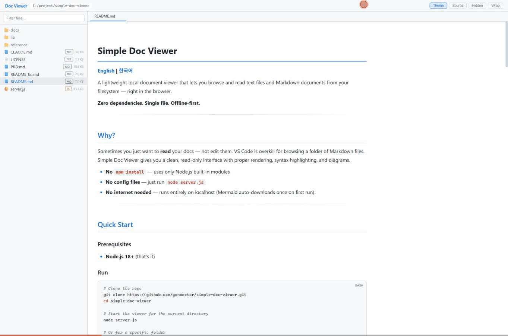
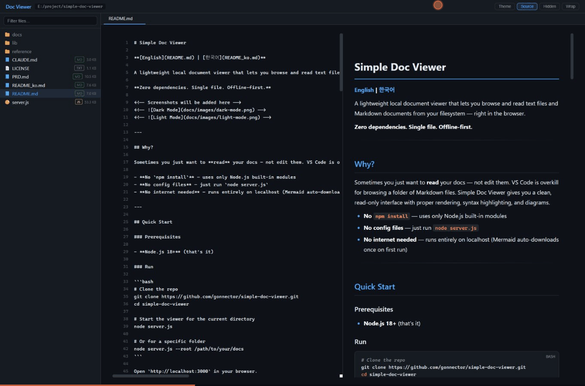

# Simple Doc Viewer

**[English](README.md) | [한국어](README_ko.md)**

로컬 파일시스템의 텍스트 파일과 마크다운 문서를 브라우저에서 탐색하고 열람할 수 있는 경량 문서 뷰어입니다.

**의존성 제로. 단일 파일. 오프라인 우선.**



---

## 왜 만들었나?

문서를 **읽기만** 하고 싶을 때가 있습니다. 마크다운 파일 몇 개 보려고 VS Code를 여는 건 과합니다. Simple Doc Viewer는 깔끔한 읽기 전용 인터페이스에 마크다운 렌더링, 구문 강조, 다이어그램을 제공합니다.

- **`npm install` 불필요** — Node.js 내장 모듈만 사용
- **설정 파일 없음** — `node server.js` 한 줄이면 끝
- **인터넷 불필요** — localhost에서 완전 오프라인 동작 (Mermaid만 최초 1회 자동 다운로드)

---

## 빠른 시작

### 필요 조건

- **Node.js 18+** (그게 전부입니다)

### 실행

```bash
# 저장소 클론
git clone https://github.com/gonnector/simple-doc-viewer.git
cd simple-doc-viewer

# 현재 디렉토리를 루트로 뷰어 시작
node server.js

# 특정 폴더 지정
node server.js --root /path/to/your/docs

# 파일을 직접 지정해서 열기
node server.js README.md
node server.js docs/report.md
```

브라우저가 자동으로 열립니다. 포트 3000이 이미 사용 중이면 기존 프로세스를 종료하고 재시작합니다.

### 커맨드라인 옵션

| 옵션 | 단축 | 기본값 | 설명 |
|------|------|--------|------|
| `--root <경로>` | `-r` | 현재 디렉토리 | 탐색할 루트 디렉토리 |
| `--port <번호>` | `-p` | `3000` | 서버 포트 |
| `--no-hidden` | | | 숨김 파일 기본 비표시 |
| `--no-open` | | | 브라우저 자동 열기 비활성화 |

**파일 경로**를 인수로 직접 전달하면 바로 열립니다:

```bash
node server.js README.md           # 현재 폴더의 파일 열기
node server.js docs/guide.md       # 상대 경로로 파일 열기
node server.js /absolute/path.md   # 절대 경로로 파일 열기
```

### 글로벌 별칭 설정 (선택)

어디서든 실행할 수 있도록 셸 별칭을 추가합니다:

**Bash / Zsh** (`~/.bashrc` 또는 `~/.zshrc`):
```bash
sdv() {
  node /path/to/simple-doc-viewer/server.js ${1:+--root "$1"}
}
```

**PowerShell** (`$PROFILE`):
```powershell
function sdv {
    param([string]$Path)
    if ($Path) {
        node "C:\path\to\simple-doc-viewer\server.js" --root $Path
    } else {
        node "C:\path\to\simple-doc-viewer\server.js"
    }
}
```

이후 어디서든:
```bash
sdv                    # 현재 폴더
sdv ~/Documents        # 특정 폴더
sdv README.md          # 파일 직접 열기
```

---

## 주요 기능

### 파일 드래그 앤 드롭

OS 파일 탐색기에서 파일을 그대로 브라우저 창에 드래그하면 탭으로 즉시 열립니다.

- **시각적 피드백**: 파일을 창 위에 올리면 파란 점선 오버레이 표시
- **어디서든**: 현재 탐색 루트 밖의 파일도 열기 가능
- **즉시 렌더링**: 마크다운, 코드, 텍스트 모두 드롭 즉시 렌더링

> 파일 대화상자 없음. 복사-붙여넣기 없음. 드래그하고 바로 보기.

### 파일 트리 탐색

- 폴더 클릭으로 하위 진입, `..`으로 상위 이동
- **사이드바 접기/펼치기** — `B` 키 또는 화살표 버튼으로 토글
- 파일명 실시간 필터링
- 숨김 파일 토글 (`.git`, `node_modules` 등)
- 확장자별 색상 배지
- 폴더 우선, 이름순 정렬

### 마크다운 렌더링

외부 라이브러리 없는 커스텀 마크다운 파서:

- 제목 (h1~h6) 크기별 색상 구분
- **굵게**, *기울임*, ~~취소선~~, `인라인 코드`
- 순서/비순서/중첩 목록 (스택 기반 파서로 임의 깊이 지원)
- 체크리스트
- 테이블 (왼쪽/가운데/오른쪽 정렬)
- 인용문 (중첩 레벨별 다른 색상)
- 각주 (참조 링크 + 되돌아가기)
- `<details>/<summary>` 접기/펼치기
- `<kbd>` 키보드 태그
- 수평선
- 링크 및 **이미지** (GIF, PNG, JPG, SVG, WebP 모두 인라인 렌더링)

### 구문 강조

13개 이상 언어 지원:

JavaScript, TypeScript, Python, Bash, CSS, HTML, JSON, YAML, SQL, Go, Rust, C/C++, Java

기능:
- 라인 번호 표시
- 코드 블록 언어 배지
- 키워드, 문자열, 주석, 숫자 토큰 색상
- 줄 바꿈 토글

### Mermaid 다이어그램

마크다운 내 ` ```mermaid ` 코드 블록을 자동으로 다이어그램으로 렌더링합니다. 9종 지원:

| 유형 | 예시 |
|------|------|
| Flowchart | `graph TD; A-->B` |
| Sequence Diagram | `sequenceDiagram; A->>B: msg` |
| Class Diagram | `classDiagram; class Animal` |
| State Diagram | `stateDiagram-v2; [*]-->Idle` |
| ER Diagram | `erDiagram; USER \|\|--o{ POST : writes` |
| Gantt Chart | `gantt; title Timeline` |
| Pie Chart | `pie; "A": 40` |
| Mindmap | `mindmap; root((Topic))` |
| Git Graph | `gitGraph; commit; branch feature` |

Mermaid.js (~2MB)는 최초 실행 시 자동 다운로드되어 로컬에 저장됩니다. 이후에는 CDN 의존 없이 완전 오프라인으로 동작합니다.



### Day/Night 모드



헤더의 **해/달 토글 스위치**로 다크/라이트 테마를 전환합니다:
- 모든 UI 요소 (사이드바, 콘텐츠, 탭, 버튼)
- 구문 강조 색상
- Mermaid 다이어그램 테마 (`dark` ↔ `default`)

키보드 단축키: `T`

### Split View (분할 보기)



마크다운 파일에서 **Source** 버튼을 토글하면:
- **왼쪽 패널**: 라인 번호가 있는 원본 마크다운 소스
- **오른쪽 패널**: 렌더링된 마크다운

두 패널은 비례 스크롤로 동기화됩니다.

### 상태줄

콘텐츠 영역 하단의 상태줄에서 확인할 수 있습니다:
- **전체 줄 수**: 현재 파일의 총 라인 수
- **스크롤 위치**: 문서의 몇 %를 읽고 있는지 표시

### 탭 시스템

- 파일을 탭으로 열기 (다중 파일 동시 열기)
- 클릭으로 탭 전환, `×`로 닫기
- 활성 탭 닫으면 인접 탭으로 자동 전환
- 활성 탭 하이라이트

### 키보드 단축키

| 키 | 동작 |
|----|------|
| `B` | 사이드바 접기/펼치기 |
| `T` | 테마 전환 (Day/Night) |
| `S` | 분할 보기 토글 (마크다운 전용) |
| `W` | 줄 바꿈 토글 |
| `?` | 키보드 단축키 도움말 |

---

## 아키텍처

```
simple-doc-viewer/
  server.js            # 서버 + API + 프론트엔드 전부 포함 (~2300줄)
  lib/
    mermaid.min.js      # 첫 실행 시 자동 다운로드
  reference/            # 프로토타입 및 테스트 문서
  docs/                 # 설계 문서, 개발 일지
```

### 동작 방식

```
브라우저 (localhost:3000)  <-->  Node.js HTTP 서버  <-->  로컬 파일시스템
```

`server.js`가 SPA(Single Page Application)를 인라인 HTML로 서빙합니다. 프론트엔드는 JSON API를 호출해 디렉토리를 탐색하고 파일을 읽습니다. 모든 통신은 `127.0.0.1`에서만 이루어지며 외부 접근은 불가합니다.

### API 엔드포인트

| Method | Endpoint | 파라미터 | 설명 |
|--------|----------|---------|------|
| GET | `/` | — | SPA 프론트엔드 서빙 |
| GET | `/api/list` | `path` (디렉토리) | 디렉토리 목록 (JSON) |
| GET | `/api/read` | `path` (파일) | 파일 내용 (JSON) |
| GET | `/api/image` | `path` (이미지 파일) | 이미지 서빙 (GIF, PNG, JPG, SVG, WebP) |
| GET | `/api/chroot` | `path` (디렉토리) | 서버 루트 변경 (드래그 앤 드롭용) |
| GET | `/lib/mermaid.min.js` | — | Mermaid 라이브러리 |

---

## 보안

Simple Doc Viewer는 **로컬 전용**으로 설계되었습니다:

| 보안 조치 | 구현 방식 |
|-----------|----------|
| **Localhost 전용** | `127.0.0.1` 바인딩 — 외부 접근 불가 |
| **경로 순회 방지** | `path.resolve()` + `ROOT_DIR` 접두사 검증 |
| **바이너리 차단** | 텍스트 파일 확장자 화이트리스트 |
| **대용량 제한** | 1MB 초과 파일 거부 |

> **주의**: 이 도구는 개인 로컬 사용 목적입니다. 인터넷이나 신뢰할 수 없는 네트워크에 노출하지 마세요.

---

## 지원 파일 유형

### 렌더링
- `.md` — 마크다운 (전체 렌더링 + Mermaid 다이어그램 + 인라인 이미지)

### 구문 강조
- `.js`, `.ts` — JavaScript / TypeScript
- `.py` — Python
- `.sh`, `.bash` — 셸 스크립트
- `.css` — CSS
- `.html` — HTML
- `.json` — JSON
- `.yaml`, `.yml` — YAML
- `.sql` — SQL
- `.go` — Go
- `.rs` — Rust
- `.c`, `.cpp`, `.h` — C/C++
- `.java` — Java

### 일반 텍스트
- `.txt`, `.log`, `.cfg`, `.env`, `.ini`, `.toml`, `.xml`, `.csv`, `.gitignore`, `.dockerfile` 등

---

## 로드맵

- [ ] **v0.6**: LaTeX 수식 렌더링 (KaTeX)
- [ ] 디렉토리 전체 파일 검색

---

## 라이선스

[MIT](LICENSE)

---

Node.js와 외부 의존성 제로로 만들었습니다.
