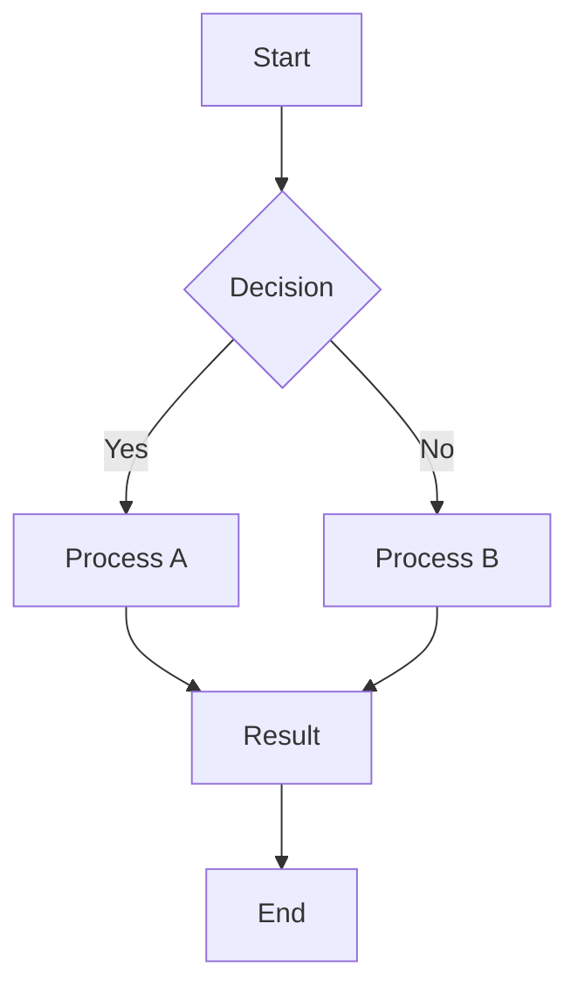
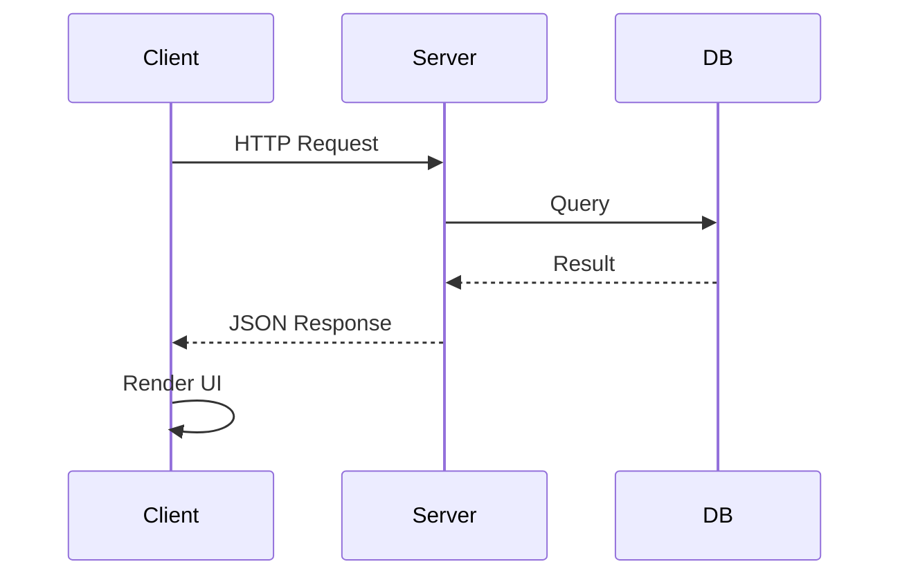
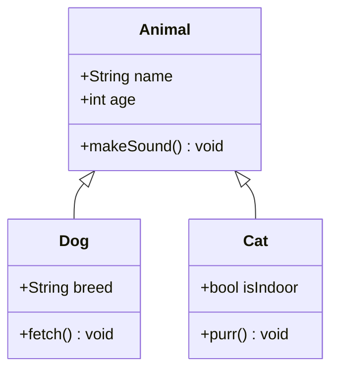
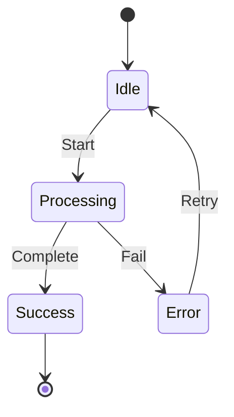
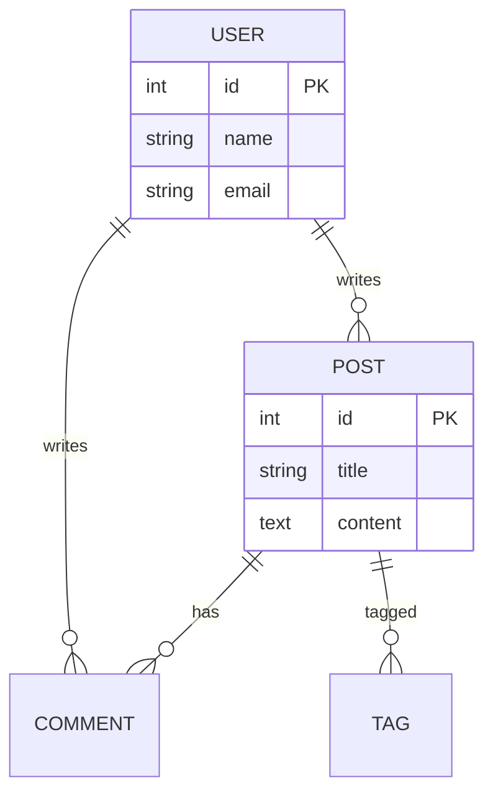
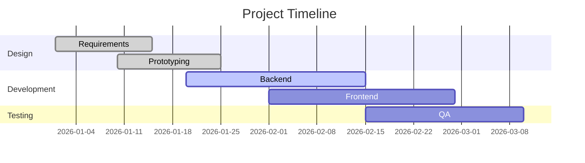
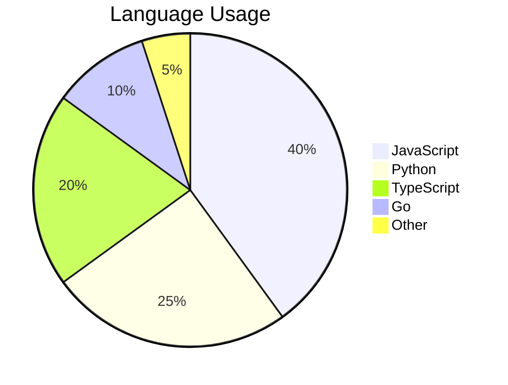
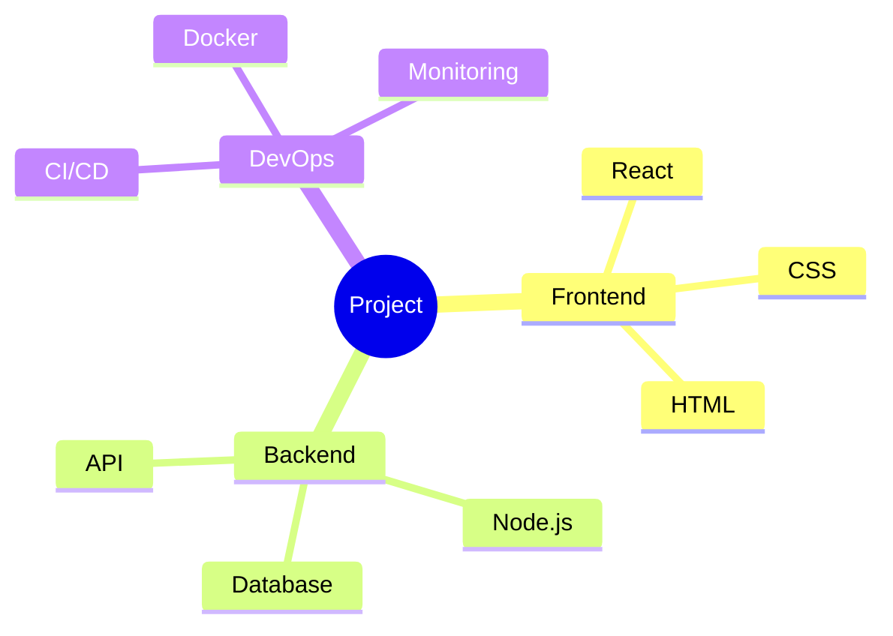
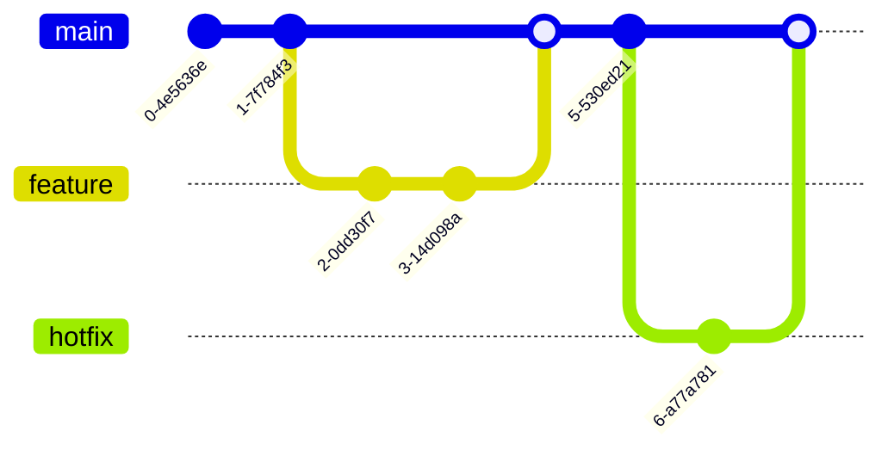

# Mermaid 다이어그램 테스트

이 문서는 Mermaid가 지원하는 다양한 다이어그램 유형을 테스트합니다.

---

## 1. Flowchart

## 2. Sequence Diagram

## 3. Class Diagram

## 4. State Diagram

## 5. Entity Relationship Diagram

## 6. Gantt Chart

## 7. Pie Chart

## 8. Mindmap

## 9. Git Graph

