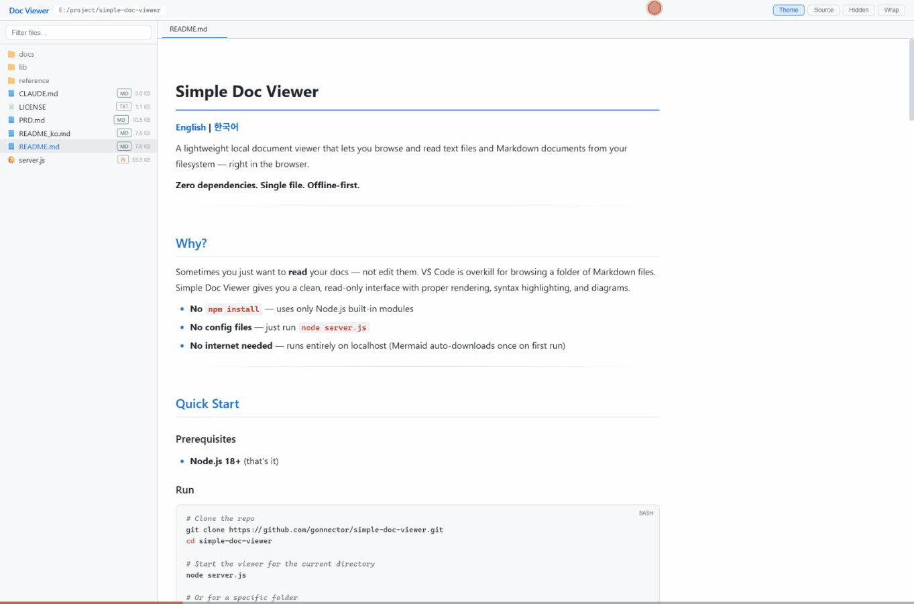
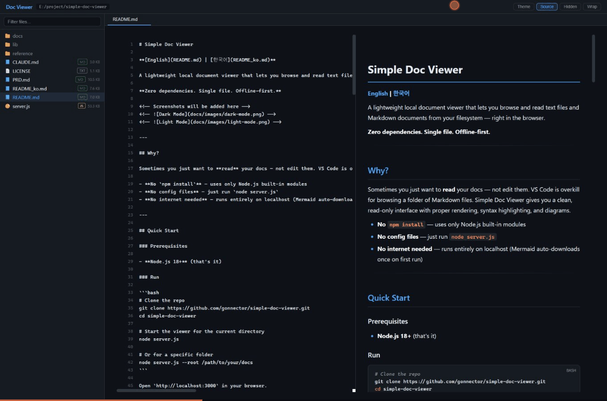

# SDV v0.54 파서 강화 쇼케이스

이 문서는 **이번 업데이트에서 새로 지원된 문법**만으로 구성되어 있습니다.
이전 버전에서는 깨지거나 렌더링되지 않던 항목들입니다.

---

## 1. YAML Frontmatter → 메타데이터 카드

위에 보이는 카드가 이번에 추가된 기능입니다.
`tags` 필드의 배열 값은 자동으로 태그 뱃지로 변환됩니다.

---

## 2. 밑줄 Bold / Italic

기존에는 `**별표**`와 `*별표*`만 지원했습니다.

| 문법 | 결과 |
|------|------|
| `__밑줄 Bold__` | __밑줄 Bold__ |
| `_밑줄 Italic_` | _밑줄 Italic_ |
| `___밑줄 Bold Italic___` | ___밑줄 Bold Italic___ |
| `**별표 Bold**` | **별표 Bold** |
| `*별표 Italic*` | *별표 Italic* |

---

## 3. 이스케이프 문자

마크다운 특수문자를 그대로 표시하고 싶을 때 `\`를 앞에 붙입니다.

- \*이건 기울임이 아닙니다\*
- \#이건 제목이 아닙니다
- \[이건 링크가 아닙니다\](http://example.com)
- 백슬래시 자체: \

---

## 4. 인라인 수학 $...$

오일러 공식: $e^{i\pi} + 1 = 0$

이차방정식의 근: $x = \frac{-b \pm \sqrt{b^2 - 4ac}}{2a}$

---

## 5. HTML 인라인 태그 보존

이전에는 `<kbd>` 등이 일반 텍스트로 출력됐습니다.

단축키: <kbd>Ctrl</kbd> + <kbd>Shift</kbd> + <kbd>P</kbd>

윗첨자: H<sub>2</sub>O는 물이고, E=mc<sup>2</sup>는 질량-에너지 등가입니다.

---

## 6. `<details>` 내부 마크다운 렌더링

이전에는 접기/펼치기 안의 마크다운이 plain text로 출력됐습니다.

<details>
<summary>클릭하여 펼치기 — 내부에 마크다운이 렌더링됩니다</summary>

### 접힌 영역 안의 제목

- **굵은 리스트 항목**
- *기울임 항목*
- `코드 항목`

| 내부 테이블 | 값 |
|---|---|
| A | 100 |
| B | 200 |

> 인용문도 정상 렌더링됩니다.

```python
def hello():
    print("details 내부의 코드 블록!")
```

</details>

---

## 7. 추가된 구문 하이라이팅 언어

### YAML

```yaml
# 서버 설정
server:
  host: localhost
  port: 3000
  debug: true

database:
  driver: postgresql
  name: myapp_production
  pool_size: 25

features:
  - name: dark-mode
    enabled: true
  - name: export-pdf
    enabled: true
```

### CSS

```css
/* 다크 테마 카드 컴포넌트 */
.card {
  background: var(--surface);
  border-radius: 12px;
  padding: 24px;
  box-shadow: 0 4px 12px rgba(0, 0, 0, 0.15);
  transition: transform 0.2s ease;
}

.card:hover {
  transform: translateY(-2px);
}

@media (max-width: 768px) {
  .card { padding: 16px; }
}
```

### HTML

```html
<!DOCTYPE html>
<html lang="ko">
<head>
  <meta charset="UTF-8">
  <title>SDV Showcase</title>
  <link rel="stylesheet" href="style.css">
</head>
<body>
  <div class="container" id="app">
    <h1>Hello, SDV!</h1>
    <p class="description">마크다운 뷰어</p>
  </div>
  <script src="app.js" async></script>
</body>
</html>
```

### SQL

```sql
-- 최근 7일간 활성 사용자 집계
SELECT
    u.name,
    u.email,
    COUNT(s.id) AS session_count,
    MAX(s.created_at) AS last_active
FROM users u
INNER JOIN sessions s ON s.user_id = u.id
WHERE s.created_at >= CURRENT_DATE - INTERVAL '7 days'
  AND u.is_active = true
GROUP BY u.id, u.name, u.email
HAVING COUNT(s.id) > 3
ORDER BY session_count DESC
LIMIT 20;
```

---

## 8. 모든 기능 조합 테스트

> __밑줄 Bold 인용문__ 안에서 _밑줄 Italic_도 동작하고,
> <kbd>Ctrl</kbd>+<kbd>C</kbd>도 보존되며,
> 인라인 수학 $\sum_{i=1}^{n} i = \frac{n(n+1)}{2}$도 렌더링됩니다.

<details>
<summary>접기 안에서 YAML 코드 블록</summary>

```yaml
test:
  nested: true
  items:
    - markdown
    - inside
    - details
```

</details>

---

*이 문서가 정상적으로 렌더링되면 SDV v0.54 파서 강화가 성공적으로 적용된 것입니다.*

---

## 9. 이미지 & 링크 테스트

### 외부 링크
- [GitHub](https://github.com)
- [Google](https://www.google.com)
- 자동 링크: https://www.example.com

### 로컬 이미지 (상대 경로)


### 로컬 이미지 (상대 경로 2)

